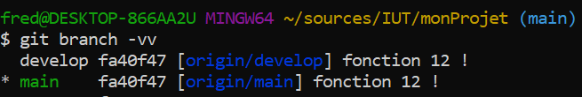

Reprise en main de GIT

Dans ce TD, nous allons réaliser un ensemble de manipulations sur GIT en simulant des cas d'usage de la vie réelle.


# Table of matières
1. [Je commence un projet](#introduction)
2. [Je livre mon projet aux utilisateurs](#paragraph1)
3. [Je monte une équipe de développement pour mon projet](#paragraph2)


# Je commence un projet <a name="introduction"></a>

Pour le moment, c'est un projet personnel,je vais juste travailler sur mon ordi en local.  
Je me place dans un répertoire de travail et je tape :    
```git init```

Cela veut juste dire que je vais utiliser git comme gestionnaire de source pour ce projet.


On peut constater qu'un répertoire .git a été crée dans mon répertoire 


C'est dans ce répertoire que git va enregistrer tout ce qui lui est nécessaire pour historiser les modifications sur mon projet

Si je demande un ```git status```, git m'indique que pour le moment je n'ai de neuf dans ce projet


## J'ajoute une première fonction 

On simule l'ajout d'une fonction par l'ajout d'un fichier qui à pour nom le fonction de la fonction.


Si je demande un ```git status```, git m'indique ce qui a changé.


Git a détecté qu'il y a un nouveau fichier et nous indique que si nous voulons l'ajouter à son contrôle de version, nous pouvons faire ``` git add nom_du_fichier ```


On a toujours aucun commit donc aucune version de notre code source !!
On sait juste que le fichier que l'on vient d'ajouter fait partie des changements qui auront lieu dans le prochain commit.

Donc contrairement à d'autres gestionnaires de sources, Git introduit la notion de zone de "staging" dans laquelle on trouve l'ensemble des modification qui feront partie du prochain commit.

On peut enfin créer notre première version du code en faisant un ```git commit```


On peut voir l'historique des versions avec ```git log```


### Quel est l'interêt de la zone de staging ?

* On peut avoir des fichiers dans son répertoire de travail et ne pas vouloir les ajouter au contrôle de version

* On peut modifier 10 fichiers dans son répertoire de travail mais n'inclure que la modification d'un seul dans le prochain commit.

Exemple : Je crée 2 nouvelles fonctions , mais je n'en "commit" qu'une seule pour le moment.


### Comment on peut enlever un fichier de la zone de staging ?

Si j'ai ajouté par erreur un fichier à la zone de staging , comme ici ou j'ai ajouté par erreur la fonction4


Je peux retirer un fichier de la zone de staging grâce à ```git reset```


### Comment on peut voir les modifications qui ont été réalisée sur un fichier ? 

Par exemple, si je modifier mon fichier fonction1.html qui contient initialement ça : 


vers ça : 


Tant que le fichier n'a pas été ajouté en zone de staging , je peux faire :


Dès qu'il a été ajouté au staging alors cette commande ne fonctionne plus :


Et il faut utiliser :  


# Je livre mon projet aux beta-testeurs <a name="paragraph1"></a>
J'ai ajouté 10 fonction à mon logiciel et il va être mise à disposition d'utilisateurs.
Si ils trouvent des bugs je devrais les corriger rapidement et relivrer le soft.  
Mais j'ai encore plein d'autres idées de fonctions géniales à apporter à mon produit.  
C'est comme si je devais avoir 2 versions différentes de mon produit...  Les branches sont là pour ça.

Jusqu'à présent j'ai toujours travaillé sur la branche "master" ou "main" ( cela dépend de la version de git )

Si je tape la commande ```git branch --all``` 


Je vois qu'il n'existe qu'une seule branche à mon projet.
Je décide donc du fonctionnement suivant, la branche "main" me servira pour le version de production et je vais créer une branche "develop" qui me servira à ajouter des nouvelles fonctions.

```git branch develop``` me permet de créer ma branche.


J'ai donc désormais 2 branches pour mon projet. Si je veux ajouter des nouvelles fonctions, je dois travailler sur la branche "develop". Pour me placer sur la branche "develop", j'utilise la commande ``` git checkout develop```


Je peux alors ajouter une nouvelle fonction, la onzième, à mon projet sans craindre de déstabiliser la version de production.


En effet, si je retourne sur ma branche "main", on ne trouve plus trace de la fonction11 


Je peux donc utiliser "main" pour corriger uniquement les bugs de production
Par exemple, disons que la fonction5 avait un bug et que la correction consiste à renommer le fichier fonction5.html en fonction5Corrigee.html


Si je regarde l'historique de ma branche "main" grace à ```git log```


Je vois que je n'ai qu'un correctif qui a été appliqué depuis que la version est partie en production.
Je suis donc plus serein pour livrer les corrections

### Gérer la vie des 2 branches 

Corriger les bugs et apporter de la stabilité c'est bien , mais les utilisateurs sont quand même très demandeurs de nouvelles fonctionnalités. Ma fonction11 est très attendue par la communauté et je voudrais l'inclure dans la version de production.

Je peux demander à git de ramener les modifications faites dans la branche "develop" vers la branche "main" via la commande ```git merge``` 

Si on regarde l'historique de la branche "develop" :  


On voit qu'il y a qu'un commit qui a été ajouté depuis que cette branche a été tirée depuis "main", dont le merge va consister à rapatrier ce commit.

On se place sur la branche "cible" ( dans notre cas , "main" ) et on lance la commande de merge en précisant la branche "source" ( dans notre cas, "develop" )


On voit dans l'historique que le commit de la fonction11 est désormais présent dans la branche "main" , ainsi qu'un commit de merge


C'est plus clair avec une vue de type graphe.


On peut également reprendre les corrections dans la branche de développement.


### Une alternative pour ceux qui souhaitent garder un historique plus lisible 


# Mon projet va partir en production <a name="paragraph2"></a>

Les choses sérieuses vont commencer, j'ai une équipe qui va travailler sur le projet.
J'ai besoin d'une forge pour que le code source ne soit pas perdu si mon ordinateur lâche mais également pour le partager avec les membres de l'équipe.

Je vais utiliser GitLab comme forge.  
Je me connecte à la forge de l'IUT et je demande la création d'un nouveau projet "test".  
La forge de donne immédiatement toutes les informations dont j'ai besoin pour intégrer mon code source


Je n'ai plus qu'a suivre ce que la forge m'indique 


Mon projet, avec tous les commits et toutes les branches , est arrivé sur la forge.


Un développeur qui doit récupérer le code source aura juste à exécuter la commande ``` git clone ```


Il pourra alors travailler sur une copie locale du code source, créer des branches , faire des commit, etc.
Comme il a récupérer le projet depuis la forge, il existe un lien l'espace de travail local à son poste et la forge.
Ce lien est appelé "remote"

On peut lister les différentes remotes d'un espace de travail local en faisant 
```git remote -v```

Dans notre cas, cela donne


Nous avons un seul remote déclaré , dont le nom est "origin" et désigne la forge de l'IUT.

Grâce à ce lien remote, quand le développeur est satisfait de son travail local, il pourra le remonter vers la forge grâce à la commande git push.

git push , prend en premier paramètre le nom d'un remote et en second paramètre le nom d'une branche.

Par exemple, ''' git push origin main''' va remonter via le remote origin le contenu de la branche main

Attention toutefois à certaines subtilités. Avec git push , le nom de la remote et le nom de la branche sont optionnels.

Si on ne précise pas le nom de la branche, git utilise la branche courante de l'espace de travail
Si on ne précise pas le nom de remote, git utilise le remote associé à la branche.

__Il y a un remote associé à une branche ????__
Oui , on peut d'ailleurs voir les remote pour chaque branche via la commande ```git branch -vv```



Dans le cas d'une nouvelle branche locale, on a pas de remote , donc si on essaye de faire un push sur une branche de ce type, on va recevoir un message d'erreur


git nous affiche lui même la solution, pour ajouter une remote par défaut à une branche, il faut utiliser ```git push --setupstream nom_du_remote```

On ne devra le faire qu'une fois par branche , car ensuite la branche gardera son remote associé.


Désormais un simple ```git push``` sans aucun argument nous permettra de remonter les commits vers la forge


## L'enfer c'est les autres

Dès que l'on commence à travailler à plusieurs sur un projet, on va devoir gérer un certains nombres de nouveaux usages et les problèmes qui vont avec.

Nous allons procéder par l'exemple pour reproduire certaines situations fâcheuses et voir comment git permet de les gérer.


### Le cas ou cela se passe bien

Alice et Bob commencent à travailler sur notre projet. 
Alice doit réaliser la fonctionA
Bob doit réaliser la fonctionB

Tous les deux clonent le projet depuis la forge et se placent sur la branche "develop"

Alice realise la fonctionA et remonte son commit dans la forge la première.
Lorsque Bob veut à son tour remonter son commit pour ajouter la fonctionB, il obtient   


Impossible d'envoyer via un lien remote un nouveau commit si nous n'avons pas localement les derniers commits.

Pour récupérer les derniers commits, il faut utiliser la commande ```git pull```

Pour bien comprende, regardons le log avant le pull  


Puis faison le pull et regardons le log juste après


On comprend mieux, avec cette vue en graph, que l'on vient de prendre un 'commit de merge' 


Il y a plusieurs écoles face à cette situation.
* On peut être tenté, pour éviter ce cas de figure , de faire des pulls fréquemment et surtout avant de faire un commit puis de faire le push dans la foulée. Cela va réduire les risques , et si jamais il y a quand même un commit de merge , c'est accepté 

* On ne veut pas de commit de merge et dans ce cas, on peut décider de récrire l'histoire

J'ai 2 commit à envoyer , mais le deuxième est un commit de merge.
  

Je reviens un commit en arrière grâce à git reset.
Je fais comme si j'avais commencé à développer la fonction B après que la fonction A ai été ajouté dans la forge grâce à git rebase


Et ensuite je push


### Le cas ou cela se passe moins bien

Alice doit réaliser la fonctionC
Bob doit réaliser la fonctionD

Les 2 fonctions C et D utilisent une librairie commune libCD.txt qu'il faut modifier pour la fonction C et pour la fonction D.

Alice realise la fonctionC et remonte son commit dans la forge la première.
Lorsque Bob veut à son tour remonter son commit pour ajouter la fonctionD, il obtient


Bob a désormais l'habitude et il fait un git pull


Git lui indique que le fichier libCD.txt est en conflit

En effet, si on ouvre le fichier :  


Alice a ajouté la ligne "fonctionC"  
Bob a ajouté la ligne "fonctionD"   

Git ne sait plus comment gérer et nous demande de l'aider.

Bob corrige donc le fichier 


et il commit


Ouf , il a retrouvé un fonctionnement normal


# Eviter le mode panique

Bob est en cours sur un énorme développement, il a touché à plusieurs fichiers mais n'a encore fait aucun commit.
A ce moment là, il reçoit un message indiquant qu'il y a un bug qui bloque la version de prod, et qu'il doit immédiatement repasser sur la branche main pour corriger la prod.
Il fait un git checkout main et pour être sûr d'avoir la dernière version , il fait un git pull. Et là git lui dit qu'il ne peut pas faire le pull car plusieurs modifications qu'il a en cours vont être écrasée.  

Bob met sur étagère les modifications qu'il a en cours grâce à la commande ```git stash```, puis il peut faire le pull, corriger le bug , commit et push.
Ensuite, il peut retourner sur sa branche develop et demander à reprendre les modifications qu'il a is sur étagère grâce à la commande ```git stash pop``` ou ```git stash apply```

Bob a modifié un fichier par erreur, il veut annuler ses modifications
Il peut utiliser ```git reset nom_du_fichier``` 

Bob a modifié un fichier par erreur, il a fait un commit mais pas de push.Il veut annuler la modification
Si c'est le dernier commit, et qu'il ne contient que cette modification alors il peut annuler le dernier commit , en utilisant ``` git reset```

Sinon, il peut récupérer la version du fichier qui est sur la forge en utilisant


 
