Reprise en main de GIT

Dans ce TD, nous allons réaliser un ensemble de manipulations sur GIT en simulant des cas d'usage de la vie réelle.

### Je commence un nouveau projet perso

Je vais juste travailler sur mon ordi pour commencer, donc je me place dans un répertoire de travail et 
je tape : 
```git init```

Cela veut juste dire que je vais utiliser git comme gestionnaire de source pour ce projet.


On peut constater qu'un répertoire .git a été crée dans mon répertoire 


C'est dans ce répertoire que git va enregistrer tout ce qui lui est nécessaire pour historiser les modifications sur mon projet

Si je demande un ```git status```, git m'indique que pour le moment je n'ai de neuf dans ce projet


#### J'ajoute une première fonction 

On simule l'ajout d'une fonction par l'ajout d'un fichier qui à pour nom le fonction de la fonction.
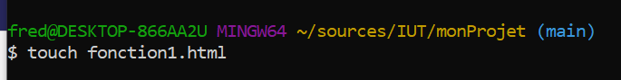

Si je demande un ```git status```, git m'indique ce qui a changé.


Git a détecté qu'il y a un nouveau fichier et nous indique que si nous voulons l'ajouter à son contrôle de version, nous pouvons faire ``` git add nom_du_fichier ```

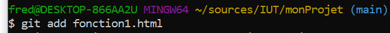

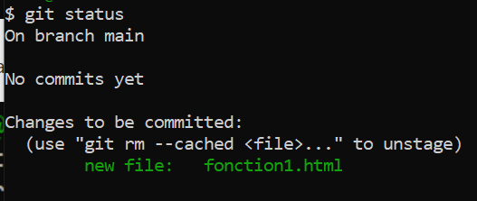

On a toujours aucun commit donc aucune version de notre code source !!
On sait juste que le fichier que l'on vient d'ajouter fait partie des changements qui auront lieu dans le prochain commit.

Donc contrairement à d'autres gestionnaires de sources, Git introduit la notion de zone de "staging" dans laquelle on trouve l'ensemble des modification qui feront partie du prochain commit.

On peut enfin créer notre première version du code en faisant un ```git commit```

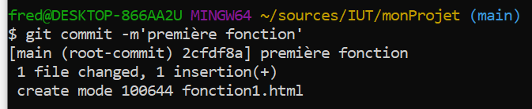

On peut voir l'historique des versions avec ```git log```

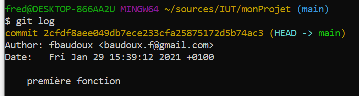

#### Quel est l'interêt de la zone de staging ?

* On peut avoir des fichiers dans son répertoire de travail et ne pas vouloir les ajouter au contrôle de version

* On peut modifier 10 fichiers dans son répertoire de travail mais n'inclure que la modification d'un seul dans le prochain commit.

Exemple : Je crée 2 nouvelles fonctions , mais je n'en "commit" qu'une seule pour le moment.

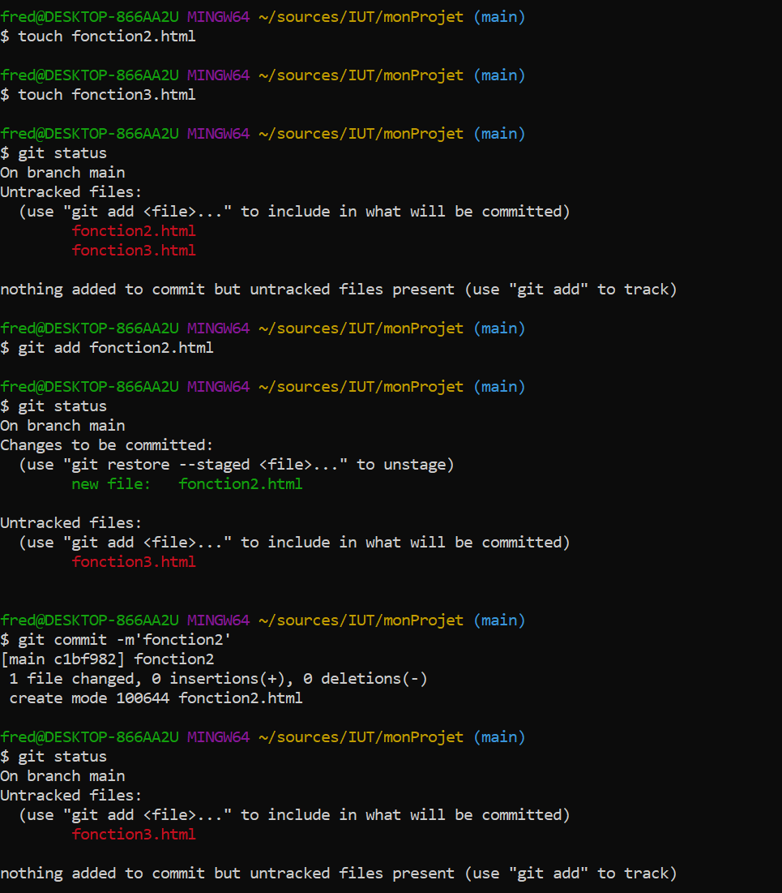

#### Comment on peut enlever un fichier de la zone de staging ?

Si j'ai ajouté par erreur un fichier à la zone de staging , comme ici ou j'ai ajouté par erreur la fonction4

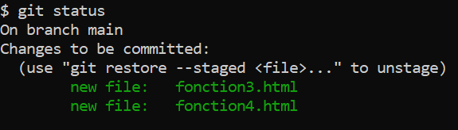

Je peux retirer un fichier de la zone de staging grâce à ```git reset```

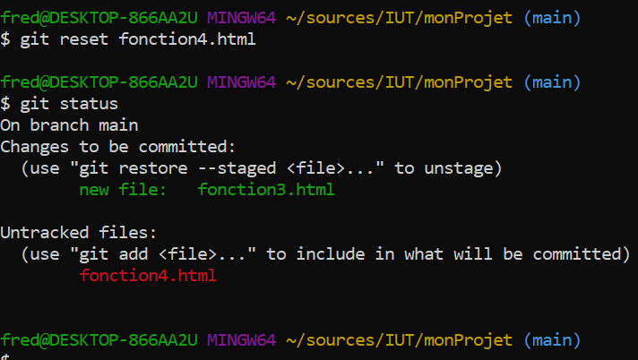


#### Comment on peut voir les modifications qui ont été réalisée sur un fichier ? 

Par exemple, si je modifier mon fichier fonction1.html qui contient initialement ça : 

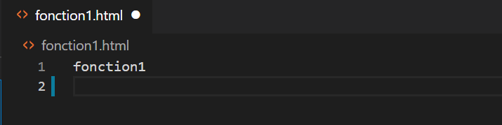

vers ça : 

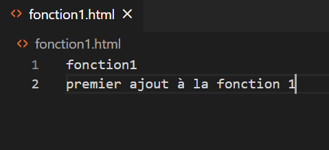

Tant que le fichier n'a pas été ajouté en zone de staging , je peux faire :

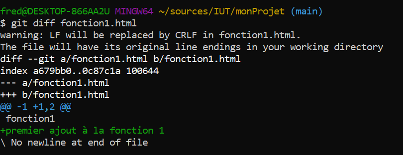

Dès qu'il a été ajouté au staging alors cette commande ne fonctionne plus :


Et il faut utiliser :  


### Mon projet prend de l'ampleur
J'ai ajouté 10 fonction à mon logiciel et il va être mise à disposition d'utilisateurs.
Si ils trouvent des bugs je devrais les corriger rapidement et relivrer le soft.  
Mais j'ai encore plein d'autres idées de fonctions géniales à apporter à mon produit.  
C'est comme si je devais avoir 2 versions différentes de mon produit...  Les branches sont là pour ça.

Jusqu'à présent j'ai toujours travaillé sur la branche "master" ou "main" ( cela dépend de la version de git )

Si je tape la commande ```git branch --all``` 


Je vois qu'il n'existe qu'une seule branche à mon projet.
Je décide donc du fonctionnement suivant, la branche "main" me servira pour le version de production et je vais créer une branche "develop" qui me servira à ajouter des nouvelles fonctions.

```git branch develop``` me permet de créer ma branche.


J'ai donc désormais 2 branches pour mon projet. Si je veux ajouter des nouvelles fonctions, je dois travailler sur la branche "develop". Pour me placer sur la branche "develop", j'utilise la commande ``` git checkout develop```


Je peux alors ajouter une nouvelle fonction, la onzième, à mon projet sans craindre de déstabiliser la version de production.


En effet, si je retourne sur ma branche "main", on ne trouve plus trace de la fonction11 


Je peux donc utiliser "main" pour corriger uniquement les bugs de production
Par exemple, disons que la fonction5 avait un bug et que la correction consiste à renommer le fichier fonction5.html en fonction5Corrigee.html


Si je regarde l'historique de ma branche "main" grace à ```git log```
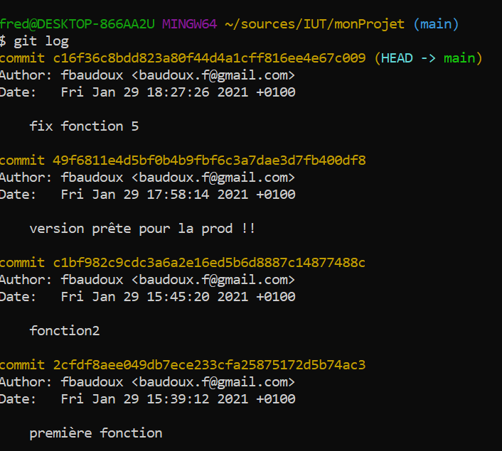

Je vois que je n'ai qu'un correctif qui a été appliqué depuis que la version est partie en production.
Je suis donc plus serein pour livrer les corrections

### Gérer la vie des 2 branches 

Corriger les bugs et apporter de la stabilité c'est bien , mais les utilisateurs sont quand même très demandeurs de nouvelles fonctionnalités. Ma fonction11 est très attendue par la communauté et je voudrais l'inclure dans la version de production.

Je peux demander à git de ramener les modifications faites dans la branche "develop" vers la branche "main" via la commande ```git merge``` 

Si on regarde l'historique de la branche "develop" :  
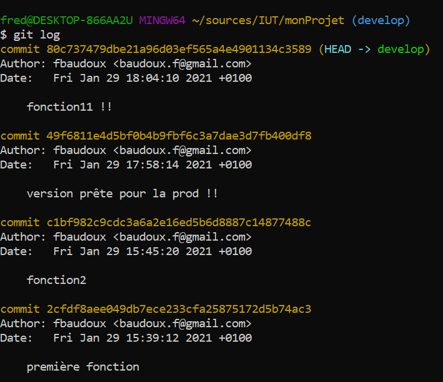

On voit qu'il y a qu'un commit qui a été ajouté depuis que cette branche a été tirée depuis "main", dont le merge va consister à rapatrier ce commit.

On se place sur la branche "cible" ( dans notre cas , "main" ) et on lance la commande de merge en précisant la branche "source" ( dans notre cas, "develop" )


On voit dans l'historique que le commit de la fonction11 est désormais présent dans la branche "main" , ainsi qu'un commit de merge


C'est plus clair avec une vue de type graphe.

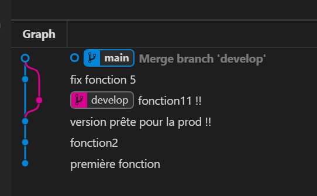

ON peut également reprendre les corrections dans la branche de développement.

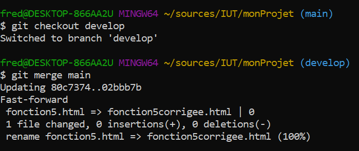

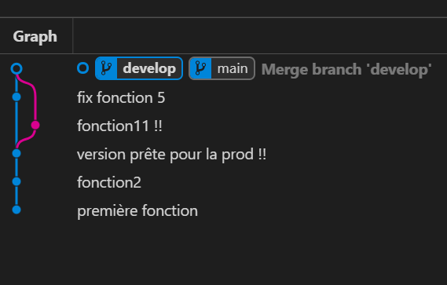

### Une alternative pour ceux qui souhaitent garder un historique plus lisible 


## Tags

Comme ce n'est pas évident de se rappeler d'un SHA-1 , on peut marquer un commit d'un tag qui nous permettra de le retrouver facilement  
On peut mettre un tag sur le dernier commit en utilisant __git tag__  
On peut mettre un tag sur un commit passé en utilisant __git tag "sha-1 du commit"__  
Attention, quand on pose un tag sur un repository local, il n'est pas exporté sur le repository distant ( la forge ) via la commande push.  
Il faut demander explicitement à remonter les tags sur la forge via la commande : __git push origin --tags__
A partir du moment ou un tag a été posé, on peut retrouver la version du code source qui correspond à ce tag , en faisant __git checkout "nom du tag"__


## Message de commit

Il est important que les messages de commit soient explicites et que des conventions soient respectées par l'équipe.

```<type>(<portée>): <sujet>```

ou type peut prendre les valeurs suivantes

* build : changements qui affectent le système de build ou des dépendances externes (npm, make…)
* ci : changements concernant les fichiers et scripts d’intégration ou de configuration (Travis, Ansible, BrowserStack…)
* feat : ajout d’une nouvelle fonctionnalité
* fix : correction d’un bug
* perf : amélioration des performances
* refactor : modification qui n’apporte ni nouvelle fonctionalité ni d’amélioration de performances
* style : changement qui n’apporte aucune alteration fonctionnelle ou sémantique (indentation, mise en forme, ajout d’espace, renommante d’une variable…)
* docs : rédaction ou mise à jour de documentation
* test : ajout ou modification de tests

ou portée représente la fonctionnalité impactée

ou sujet décrit les modifications apportées en moins de 80 caractères 
* on utilise l’impératif présent : add, change, update, remove et non pas changed ou removed. add caching for better performance par exemple.