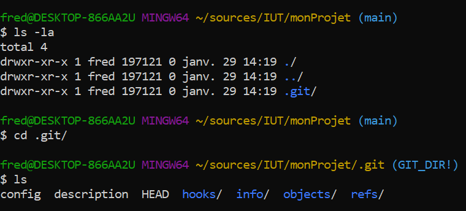
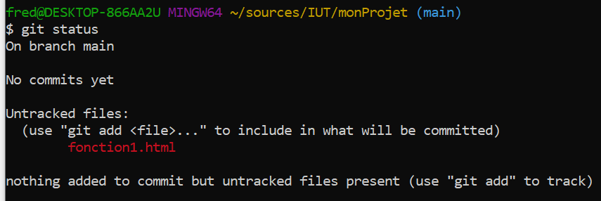

Reprise en main de GIT

Dans ce TD, nous allons réaliser un ensemble de manipulations sur GIT en simulant des cas d'usage de la vie réelle.

### Je commence un nouveau projet perso

Je vais juste travailler sur mon ordi pour commencer, donc je me place dans un répertoire de travail et 
je tape : 
```git init```

Cela veut juste dire que je vais utiliser git comme gestionnaire de source pour ce projet.


On peut constater qu'un répertoire .git a été crée dans mon répertoire 



C'est dans ce répertoire que git va enregistrer tout ce qui lui est nécessaire pour historiser les modifications sur mon projet

Si je demande un ```git status```, git m'indique que pour le moment je n'ai de neuf dans ce projet


### J'ajoute une première fonction 

On simule l'ajout d'une fonction par l'ajout d'un fichier qui à pour nom le fonction de la fonction.


Si je demande un ```git status```, git m'indique ce qui a changé.



Git a détecté qu'il y a un nouveau fichier et nous indique que si nous voulons l'ajouter à son contrôle de version, nous pouvons faire ``` git add nom_du_fichier ```


## Merge et Rebase

* Créer un nouveau projet , qui va disposer d'une branche master et d'une branche dev
* Faire 2 commits sur la branche master pour ajouter 2 fonctions
* Faire 1 commit sur la branche dev pour ajouter 1 fonctions
* Faire un commit sur la branche master pour corriger la fonction 1
* Faire un merge de dev vers master
* Regarder l'historique des commits dans la vue graph de la forge

* Repartir en arrière avec git reset --hard et git push -f (pas bien !)
* Faire un rebase de la branche dev sur master. ( checkout dev , puis rebase master puis push)
* Faire un merge de dev dans master ( checkout master, merge dev , puis push )
* Regarder l'historique des commits dans la vue graph de la forge

## Tags

Comme ce n'est pas évident de se rappeler d'un SHA-1 , on peut marquer un commit d'un tag qui nous permettra de le retrouver facilement  
On peut mettre un tag sur le dernier commit en utilisant __git tag__  
On peut mettre un tag sur un commit passé en utilisant __git tag "sha-1 du commit"__  
Attention, quand on pose un tag sur un repository local, il n'est pas exporté sur le repository distant ( la forge ) via la commande push.  
Il faut demander explicitement à remonter les tags sur la forge via la commande : __git push origin --tags__
A partir du moment ou un tag a été posé, on peut retrouver la version du code source qui correspond à ce tag , en faisant __git checkout "nom du tag"__


## Message de commit

Il est important que les messages de commit soient explicites et que des conventions soient respectées par l'équipe.

```<type>(<portée>): <sujet>```

ou type peut prendre les valeurs suivantes

* build : changements qui affectent le système de build ou des dépendances externes (npm, make…)
* ci : changements concernant les fichiers et scripts d’intégration ou de configuration (Travis, Ansible, BrowserStack…)
* feat : ajout d’une nouvelle fonctionnalité
* fix : correction d’un bug
* perf : amélioration des performances
* refactor : modification qui n’apporte ni nouvelle fonctionalité ni d’amélioration de performances
* style : changement qui n’apporte aucune alteration fonctionnelle ou sémantique (indentation, mise en forme, ajout d’espace, renommante d’une variable…)
* docs : rédaction ou mise à jour de documentation
* test : ajout ou modification de tests

ou portée représente la fonctionnalité impactée

ou sujet décrit les modifications apportées en moins de 80 caractères 
* on utilise l’impératif présent : add, change, update, remove et non pas changed ou removed. add caching for better performance par exemple.